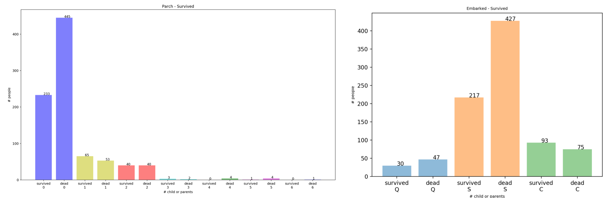
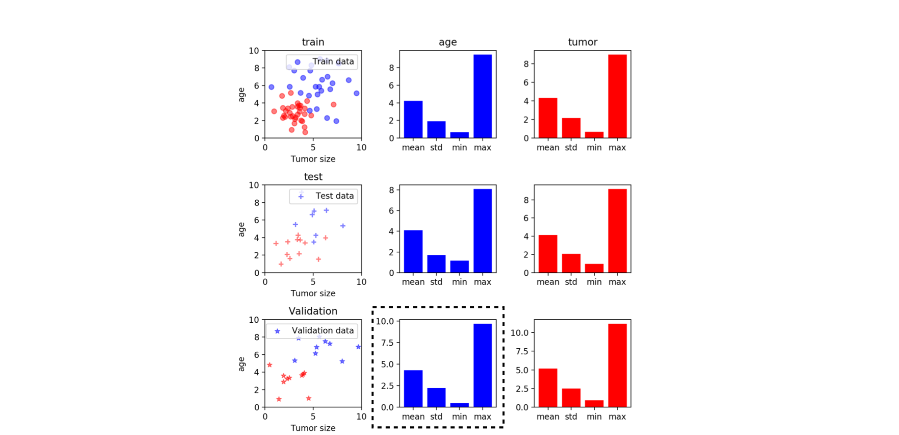

# Week_3 Homework

Week 3 은 데이터를 분석하는 pandas 와 시각화 하는 matplotlib 을 배웠습니다

pandas 와 matplotlib 을 이용해 아래 숙제를 해결해 주세요.

1. titanic_데이터셋_EDA.ipynb 에 숙제를 해결해 주세요

2. titanic_데이터셋을 이용해 embark 와 parch 특성을 이용해 각 특성별 죽은 사람의 수와 산 사람의 수를 시각화 하세요.

 그리고 결과를 github readme 에 올려주세요 

3. cancer_data.csv 을 읽고 아래와 같은 그림이 나올수 있도록 코드를 만들어 주세요.

조건은 random 하게 shuffle 을 한경우와 shuffle 을 하지 않은 경우 2가지를 만들어 시각화 해주세요.

 그리고 결과를 github readme 에 올려주세요

