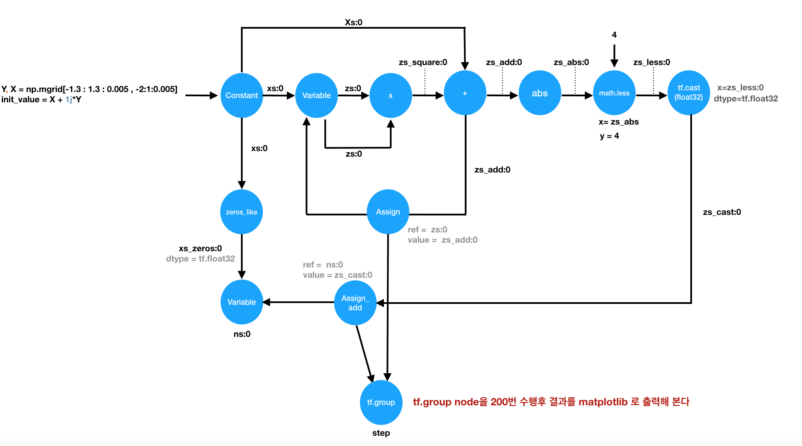
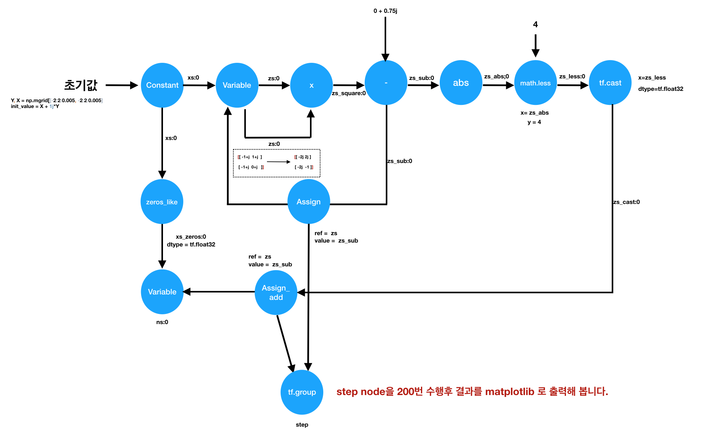
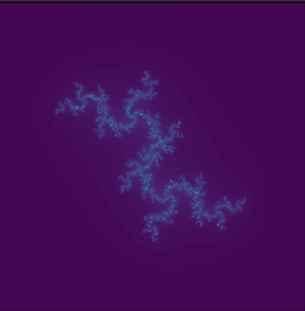

# Homework Week4

숙제 기간은 2019.4.24 까지 입니다!

1. 망델브롯 Fractal 구현하고 텐서 보드에 연결하기 
아래 그림을 보고 구현해 주세요 

  
아래 기능이 담겨져 있도록 구현해 주세요
1. Graph 을 텐서보드에 추가해주세요
2. 변수 'ns' 의 mean 값을 텐서보드에 추가해주세요. (`tf.summary.scalar` 사용)
3. 변수 'ns' 의 histogram 을 텐서보드에 추가해주세요. (`tf.summary.scalar` 사용)
4. 변수 'ns' 의 image 을 텐서보드에 추가해 주세요. (`tf.summary.scalar` 사용) 
(텐서를 `tf.summary.scalar` 에 추가할 때는 반드시 4D 텐서로 변환해야 합니다)
5. Graph 을 저장하고 복원하는 코드를 작성해주세요.
    
2. Julia fractal 은 망델브로와 다른 fractal 입니다. 

아래 Graph 을 아래 조건에 맞게 구현해 주세요.
 

1. Graph 을 텐서보드에 추가해주세요
2. 변수 'ns' 의 mean 값을 텐서보드에 추가해주세요. (`tf.summary.scalar` 사용)
3. 변수 'ns' 의 histogram 을 텐서보드에 추가해주세요. (`tf.summary.scalar` 사용)
4. 변수 'ns' 의 image 을 텐서보드에 추가해 주세요. (`tf.summary.scalar` 사용) 
(텐서를 `tf.summary.scalar` 에 추가할 때는 반드시 4D 텐서로 변환해야 합니다)
5. Graph 을 저장하고 복원하는 코드를 작성해주세요.

구현후 ns 을 `imshow` 을 이용해 출력하면 아래와 같은 그림이 나옵니다.
 

3. rain Drop 을 구현해주세요 
excercise 의 rain Drop 을 구현해주세요

4. Kmeans , KNN 을 Tensorflow 로 구현해 주세요. 

+ kmeans_implemented_by_tensorflow.ipynb
+ Knn_implemented_by_tensorflow.ipynb

5. Excercise

+ section 6 excercise 풀어오기 입니다

